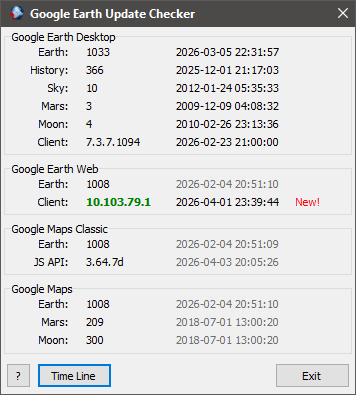
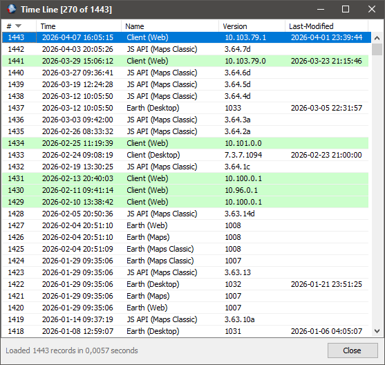

Read this in other languages: [Русский](readme.ru.md)

-----

## Google Earth Update Checker

**Google Earth Update Checker** is a utility for automatically monitoring data version changes on Google Earth and Google Maps servers. The program helps you stay informed about updates to satellite imagery and map data.

### Key Features

  * Automatic update checks on startup
  * Maintains a local database of change history
  * Configurable via command line and configuration file
  * Interface localization support

### Hotkeys

| Key   | Window    | Action                                      |
| :---- | :-------- | :------------------------------------------ |
| `F5`  | Main      | Run version check immediately               |
| `F4`  | Time Line | Edit the version of the selected entry      |
| `Del` | Time Line | Delete the selected entry from the database |

### Command Line Parameters

You can automate the program using the following flags:

  * `--force-check` — forces a version check, ignoring the `ShowPrevInfoOnly=1` setting in the configuration.
  * `--check-interval Xh` — sets the check interval (e.g., `24h`) to prevent excessive requests.

### Configuration (via ini-file)

Main parameters are stored in the configuration file.

###### Section `[Main]`

  * `ShowPrevInfoOnly` (0/1) — if set to `1`, automatic checking at startup is disabled (viewing the latest data from the DB only).
  * `Language` — language code (e.g., `en`). The translation file must be located in the `res` folder. The localization system is based on *BetterTranslationManager*.

###### Section `[UserAgent]`

Used to emulate requests from real applications:

  * `ChromeVersion` — the Google Chrome version used to generate the User-Agent string.
  * `DesktopClientVersion` — the current version of the Google Earth desktop client.

### Screenshots

