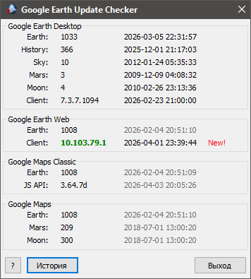
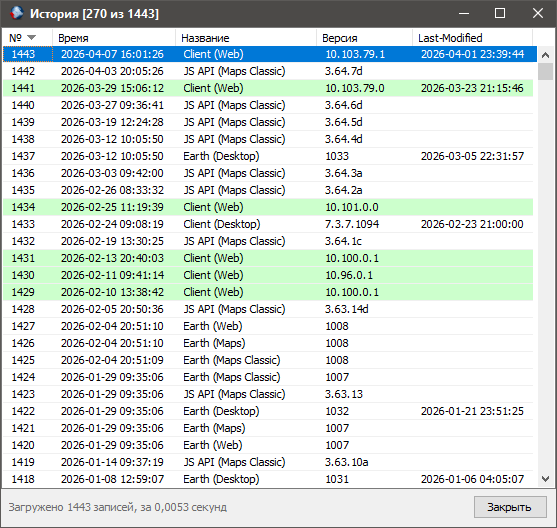

Read this in other language: [English](readme.md)

-----

## Google Earth Update Checker

**Google Earth Update Checker** — это утилита для автоматического мониторинга изменений версий данных на серверах Google Earth и Google Maps. Программа помогает оперативно узнавать об обновлении снимков и картографической информации.

### Основные возможности

  * Автоматическая проверка обновлений при запуске
  * Ведение локальной базы данных истории изменений
  * Настройка через командную строку и конфигурационный файл
  * Поддержка локализации интерфейса

### Горячие клавиши

| Клавиша | Окно    | Действие |
| :---    | :---    | :---     |
| `F5`    | Главное | Выполнить проверку версий немедленно |
| `F4`    | История | Редактировать версию выделенной записи |
| `Del`   | История | Удалить выделенную запись из базы данных |

### Параметры командной строки

Вы можете автоматизировать работу программы, используя следующие флаги:

  * `--force-check` — принудительная проверка версий, игнорируя параметр `ShowPrevInfoOnly=1` в конфигурации.
  * `--check-interval Xh` — задает интервал проверки (например, `24h`), чтобы не выполнять запросы слишком часто.

### Настройка (через ini-файл)

Основные параметры хранятся в файле конфигурации.

##### Секция `[Main]`

  * `ShowPrevInfoOnly` (0/1) — если `1`, то автоматическая проверка при старте отключена (только просмотр последних данных из БД).
  * `Language` — код языка (например, `ru`). Файл перевода должен находиться в папке `res`. Система локализации базируется на *BetterTranslationManager*.

##### Секция `[UserAgent]`

Используется для эмуляции запросов реальных приложений:

  * `ChromeVersion` — версия Google Chrome для формирования строки User-Agent.
  * `DesktopClientVersion` — версия десктопного клиента Google Earth.

### Скриншоты

